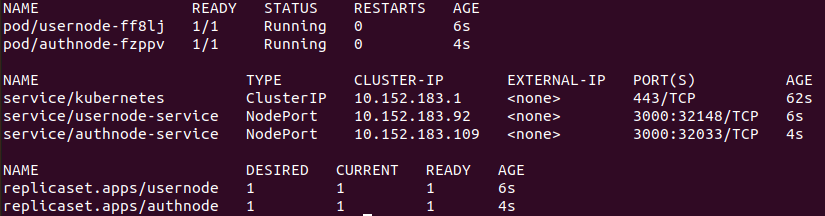
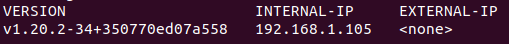

# SejutaCita Technical Test

## Technical Test Requirements

1. Dengan NodeJS, agar saudara membuat **_Rest API_** **CRUD User** dan **User Login**.
2. Framework dibebaskan, tetapi disarankan _ExpressJS_. Database bebas, tetapi disarankan _MongoDB_.
3. User Login digunakan user **(username, password)** untuk mengakses API CRUD (**token**, tetapi mendapatkan nilai tambahan jika menggunakan **refresh token**).
4. Bikin 2 users dengan **role**: 1 Admin, 1 User.
5. **Admin** bisa melakukan/mengakses _semua API CRUD_, sedangkan **User** hanya bisa mengakses data _user bersangkutan saja_ (Read)
6. Implementasi arsitektur **Microservices**, menggunakan Kubernetes dengan Docker container deploy di VPS (1 node dengan beberapa pod di dalamnya). Bagi yang belum memiliki VPS, maka cukup (a) menyiapkan semua YML agar aplikasi bisa dijalankan secara containerize dan siap di deploy di Kubernetes dan (b) di-deploy di lokal dan sertakan screenshoot.
7. Upload source code ke **Github** beserta script YML Kubernetes.
8. Bikin **dokumentasi** API nya (Postman atau Swagger) yang bisa diakses ke server Rest API nya.
9. Bikin **diagram arsitektur** nya yang menjelaskan _flow API CRUD dan Login_.
10. Lampirkan _credential Admin di Readme_.
11. Mohon submit kesini (biasanya orang kirim link Github) paling lambat 24 Februari 2020. Jika tidak bisa sebelum tanggal tersebut, mohon memberi tahu saya secepatnya saja.

# The API - Simple User API

A user simple API build using **[expressJS](https://expressjs.com/)** framework with **[MongoDB](https://www.mongodb.com/)**.
Can support **[Docker](https://www.docker.com/) containerization** and **[Kubernetes](https://kubernetes.io/)**.

There is two module for this API

- [AuthNode](https://github.com/a-johanes/sejutacita_technical_test/tree/master/AuthNode), contains API for user authentication,

```
  POST .../users/auth/login
  POST .../users/auth/register
  POST .../users/auth/refresh-token
DELETE .../users/auth/logout
```

- [UserNode](https://github.com/a-johanes/sejutacita_technical_test/tree/master/UserNode), contains API for user CRUD operation

```
   GET .../users/
   GET .../users/all
   GET .../users/:id
  POST .../users/
   PUT .../users/
   PUT .../users/:id
DELETE .../users/
DELETE .../users/all
DELETE .../users/:id
```

The user authentication is implemented using **[JWT](https://jwt.io/)** and **refresh token** mechanism

The API request examples can be seen at [doc](https://documenter.getpostman.com/view/9394904/TWDZJGS6)

The exported `Postman` documentation can also be downloaded from [exported_api.postman_collection.json](https://github.com/a-johanes/sejutacita_technical_test/blob/master/exported_api.postman_collection.json)

## System Requirements

This application has been tested on `Ubuntu 20.04` with these settings

```shell
$ node --version
v14.2.0

$ docker --version
Docker version 20.10.3, build 48d30b5

$ snap info microk8s
...
installed:          v1.20.2             (2035) 217MB classic

$ mongo --version
MongoDB shell version v4.4.0
...
```

Please follow [this link](https://microk8s.io/docs) to set up microk8s

Each node module version can be checked on `package.json` on each Package

## How to Install

### Get the Code

---

Make sure you already install all the requirements then clone or download the repository.

```bash
git clone https://github.com/a-johanes/sejutacita_technical_test.git
```

or

https://github.com/a-johanes/sejutacita_technical_test/archive/master.zip

### Install node modules

---

Go to **each** Node folder and run

```shell
$ npm i
```

to install all the dependencies.

### Set Up .env

---

Make `.env` file on **each** Node folder for the environment variables

```dosini
PORT=3000
MONGODB_URI=mongodb://host:port
DB_NAME=db_name
ACCESS_TOKEN_SECRET=secret-token
REFRESH_TOKEN_SECRET=another-secret-token
```

The default `port` for MongoDB is `27017`. You can use `localhost` as the `host` for `MONGODB_URI`. If you want to deploy this app to Kubernetes, change the `host` to `mongodb.default.svc`. That value is based on the `mongo.yaml` file. You can change the MongoDB IP Address on the `subsets.addresses.ip`

```yaml
apiVersion: v1
kind: Service
metadata:
  name: mongodb
spec:
  ports:
    - protocol: TCP
      port: 27017
      targetPort: 27017

---
apiVersion: v1
kind: Endpoints
metadata:
  name: mongodb
subsets:
  - addresses:
      - ip: 10.0.1.1 # <-- here
    ports:
      - port: 27017
        name: mongodb
```

The current IP Address is pointing to **localhost**. If you are using microk8s, **DO NOT FORGET** to enable `host-access` to access the local machine and `dns` to resolve the DNS.

```shell
$ microk8s.enable host-access

$ microk8s.enable dns

```

The `PORT` is used to run the express app. If you want to run both Node on local, make sure they have different `PORT`. E.g. `PORT=3000` for **AuthNode** and `PORT=3001` for **UserNode**.

And make sure to choose some random string for `ACCESS_TOKEN_SECRET` and `REFRESH_TOKEN_SECRET`.

### Run

---

**To run it localy**, go to the Node folder then use

```shell
$ npm start
```

Make sure both Node does not have the same `PORT` on the `.env` file.

**To build the Docker image**, go to the Node folder and run

```shell
$ docker build . -t app_name
```

If you want to start it as a **container**, user the `docker-compose.yml` file

```shell
$ docker-compose up -d
```

And for the **Kubernetes**, if you want to deploy it on the **server**, change the `spec.template.spec.containers.image` to the image you will be using and delete the `spec.template.spec.containers.imagePullPolicy`.

```yaml
# ...

spec:
  # ...
  template:
    # ...
    spec:
      containers:
        - name: authnode
          image: authnode_app # <-- here
          imagePullPolicy: Never # <-- here
          ports:
            - containerPort: 3000
# ...
```

Run the kubernets command

```shell
$ microk8s.kubectl create -f authnode.yml
```

and follow from **step 5** below.

If you want to **deploy it localy**, follow these steps (only for microk8s)

1. Build your app image using Docker

```shell
$ docker build . -t authnode
```

2. Save the image to tar

```shell
$ docker save authnode > authnode.tar
```

3. Import the saved image to microk8s image registy

```shell
$ microk8s.ctr image import authnode.tar
```

4. Run the Kubernetes script

```shell
$ microk8s.kubectl create -f authnode.yml
```

5. Look for the service port in the resource

```shell
$ microk8s.kubectl get all
```



6. Look at the **PORT(S)** at `service/usernode-service` and `service/authnode-service`. In the image above, the **PORT** is `32148` for **usernode** and `32033` for **authnode**. Please take note on these port number.
7. Look for the internal IP Address of the node, on the image below, the internal IP is `192.168.1.105`

```shell
$ microk8s.kubectl get node -o wide
```



8. Now you can access the node using the internal ip and port, e.g. `192.168.1.105:32033`. You can try it with [REST Client](https://marketplace.visualstudio.com/items?itemName=humao.rest-client) for vscode using the `rest.http` file or use the postman and change the collection variables.
